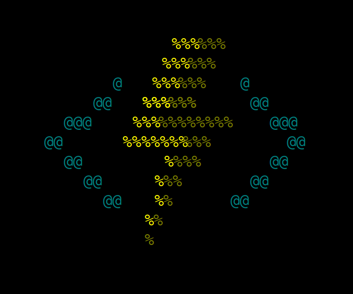
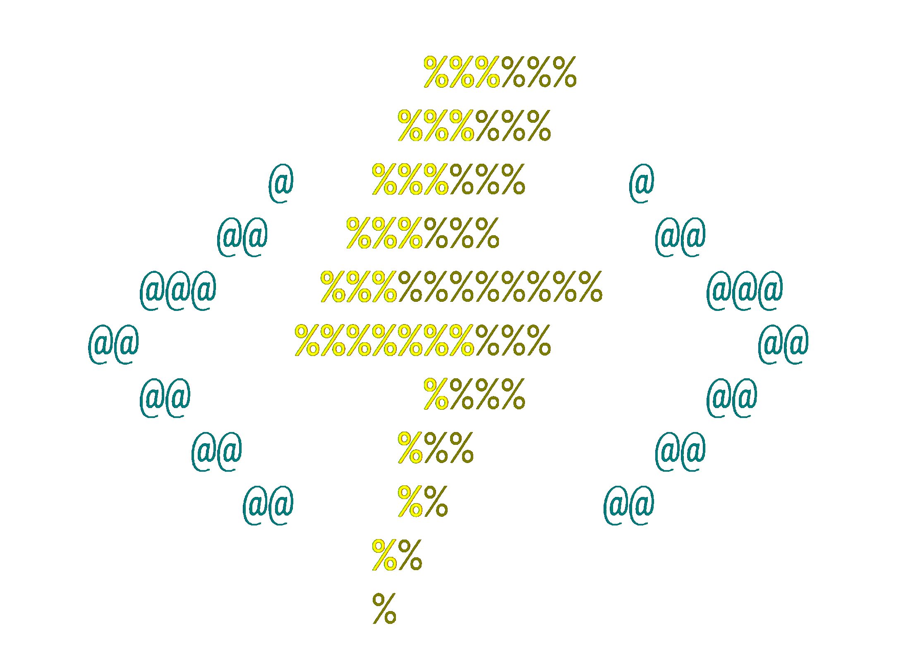

# azure-functions-ascii-art
## <⚡>

The image(s) in this repo are intended for personal use only!

### ASCII

```
                  %%%%%%
                 %%%%%%
            @   %%%%%%    @
          @@   %%%%%%      @@
       @@@    %%%%%%%%%%%    @@@
     @@      %%%%%%%%%%        @@
       @@         %%%%       @@
         @@      %%%       @@
           @@    %%      @@
                %%
                %
```

### SVG
Hand made, therefore not pixel perfect compared with the CLI. But scales infinitely, just as serverless functions! 😉

Requires the [Consolas font](https://docs.microsoft.com/en-us/typography/font-list/consolas) for the best result.


### PNG (black background)


### PNG (transparent background)
Removed the black background, there are still some dark edges, so this still looks best on a dark background.


### The reason why this repo exists 😅
[#2222](https://github.com/Azure/azure-functions-core-tools/issues/2222)